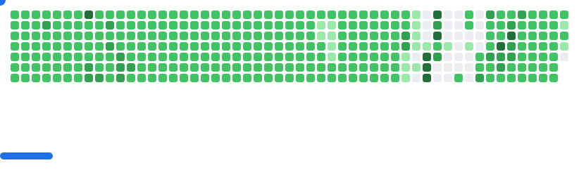

<!-- 

  
  
  

 -->

  

 

<h1 align="center">
  Hey there 
</h1>

  
  
  

---

### 🚀 **Hello, fellow Earthlings!**

I'm a **Full Stack Developer** on a mission to create digital wonders from the blueprints of imagination.

- 🔭 By day, I wield my coding wand as a **Software Engineer**, conjuring both frontend and backend magic to craft enchanting web applications that captivate users.
- 🌌 Feel free to Join me via email at [dkupper710@gmail.com](mailto:dkupper710@gmail.com).

---

### 🌟 **My Spellbook of Skills**

- **Frontend Spells:** HTML, CSS, JavaScript, React
- **Backend Incantations:** Node.js, Express, Python, Django
- **Database Potions:** MongoDB, PostgreSQL, MySQL
- **Tools of the Trade:** Git, VS Code, Docker
- **Cloud Wizardry:** AWS, Azure

---

### 🏆 **My Trophy Stats**

---

### 🔥 **My Stats**

---

## 📈 Activity Graph

---

### 🐍 **GitHub Contribution Snake**

---

<picture>
  <source media="(prefers-color-scheme: dark)" srcset="dist/breakout-dark.svg">
  <source media="(prefers-color-scheme: light)" srcset="dist/breakout-light.svg">
  
</picture>

---

### 📚 **Favorites**

- **Book:** Clean Code by Robert C. Martin
- **Tool:** VS Code
- **Podcast:** Syntax FM
- **Quote:** "Code is poetry."

---

### 😂 **Random Joke**

  

